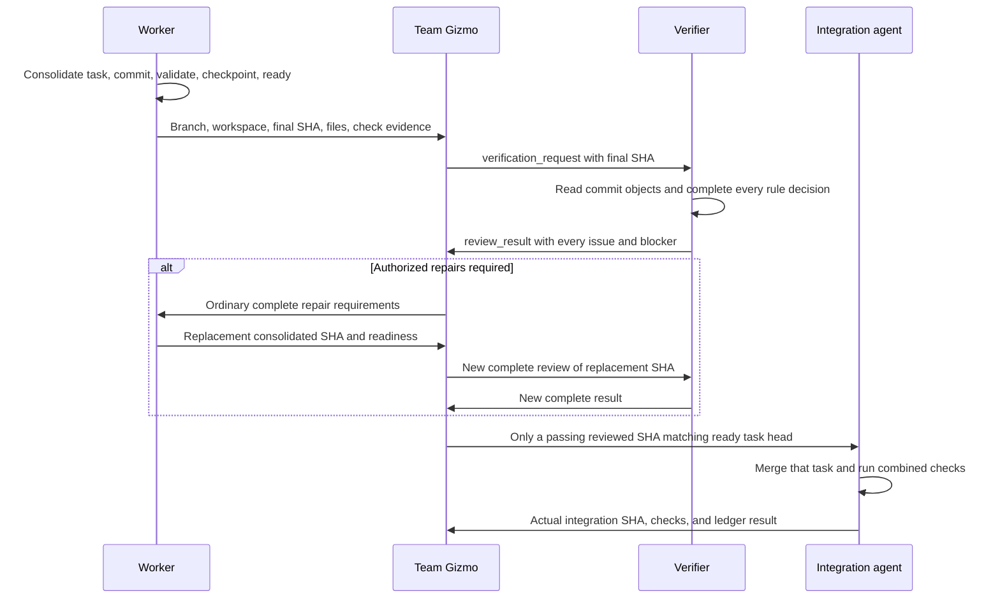

# Agent Verification Handoff

Team Gizmo starts verification when an agent with a cataloged verifier reports
committed work ready. Its paired verifier reviews the commit; the assigned
worker performs repairs. Gizmo requires a complete passing review before
integration and preserves every issue's repair context throughout the handoff.
Use the existing host channel, Git evidence, and [agent ledger](agent-ledger.md).



The integration path below applies to authorized implementation. Review-only
tasks stop after reporting the verifier result, as required by the task boundary.

## Required actions

### Discover the paired verifier

1. Read the assigned worker's entry in its owning team's `AGENTS.md` catalog.
   An optional `Verifier:` property links to the verifier's role instructions.
   Resolve the link relative to that team catalog. Use this relationship for
   any team or agent; do not select verifiers by language or directory spelling.
2. If the property is absent, continue the ordinary task completion and
   integration path. If it is present, require that role to be cataloged by its
   owning team and supported by the ledger's team/role identity vocabulary.
   An unreadable or invalid link blocks the required review; do not skip it.
3. Read only the selected verifier's role to resolve its own skill and catalog
   roots. Supply the normal assignment context and require the verifier to load
   its skill. All verifiers use the shared
   [review protocol](../agents/gizmo/skills/agent-verification/spec/communication-protocol.md)
   and [verification skill](../agents/gizmo/skills/agent-verification/SKILL.md).
   Keep subject selection in the verifier's own skill. Gizmo needs no per-agent
   launch instructions, report field, or repair protocol.
4. Retain the pairing with the worker task through repairs, conflict resolution,
   and integration. Several worker roles may share one verifier role. Read-only
   verifier results finish through the ledger's read-only path; do not schedule
   another verifier merely because a verifier completed its report.

**Prohibited:** select the Rust verifier through a language-specific condition
and ignore the TypeScript developer's cataloged verifier.

**Required:** follow `Verifier: [TypeScript verifier]` in the TypeScript worker's
team catalog, resolve its role and skill, and use the same SHA request and report
as for Rust. A future agent adds the same catalog property without a new Gizmo path.

### Preserve the parent task's scope

1. Apply the [task boundary](../../../CIRCUIT-BREAKER.md#keep-the-users-task-boundary)
   before assigning verification. Carry the parent's permitted changes and
   stopping condition in the existing assignment context.
2. For a review-only request, obtain the complete report and return every finding,
   blocker, and validation limitation through the hierarchy. Do not start the
   repair or integration steps below. A `changes_required` verdict describes
   the code; it is not permission to change it.
3. For authorized implementation or an explicitly requested repair exercise,
   use the repair steps below for in-scope issues. Preserve unrelated findings
   in the report without assigning their repair. Do not approve integration
   while a required compliance decision remains violated or blocked.

**Prohibited:** a request to check the verifier automatically becomes a worker
fixture repair task because the verifier returned useful repair instructions.

**Required:** return the exhaustive review and bounded behavior-check evidence.
Start a repair exercise only when the user's request includes that outcome.

### Apply the selected execution mode

- **`multi_agent`**
  - Gizmo assigns development, verification, repairs, and integration to their
    respective agents through the existing host and ledger workflow.
- **`single_agent`**
  - Perform those responsibilities locally without launching subagents.
  - Keep the same inventories, exhaustive review, and complete issue reporting.
  - State that independent verifier context isolation was not exercised.

**Prohibited:** select `single_agent`, launch a verifier anyway, or describe
self-review as an independent subagent review.

**Required:** perform the full review locally in `single_agent` mode and report
that limitation. Use the assignments below when running in `multi_agent` mode.

### Receive the worker's committed result

1. Give the assigned worker ordinary implementation requirements and the existing
   [task-completion procedure](../../delivery-team/agents/integration-agent/skills/local-feature/practices/local_feature/task-commits.md#finish-task-work).
   Require one consolidated task commit. The integration owner supplies the
   task branch, worktree, and fixed `task_base_sha`. The worker follows the
   ordinary delivery commands to consolidate private checkpoints before readiness.
   It must run required checks, confirm a clean checkout, and
   record its final checkpoint and readiness before notifying Gizmo.
2. Keep verifier context out of the developer assignment. Do not supply this
   handoff, the verifier role or skill, or review bookkeeping. Gizmo owns the
   decision to start verification after receiving the developer's result.
3. Receive the branch, workspace, final SHA, changed-file list, validation
   evidence, and unresolved issues. Check durable readiness even if the host
   notification is missing.
   - If no changes were needed, retain the unchanged SHA and report that fact.
     Do not require an empty commit just to produce a handoff.

**Prohibited:** give the assigned worker the verifier skill and ask it to manage its own
verification handoff, then treat its “done” message as integration approval.

**Required:** receive the assigned worker's ordinary committed result, confirm its recorded
readiness, and let Gizmo arrange the separate review.

### Check the Git handoff

1. Use these values from the ordinary developer result: `task_path` is its
   absolute worktree, `task_branch` its assigned branch, and `task_sha` its full
   final SHA. Read `checkpoint_sha` from the ready ledger record and retain the
   `task_base_sha` supplied at workspace setup. Gizmo inspects Git; it does not
   stage, commit, reset, or merge on the developer's behalf.
2. Run the read-only checks:

   ```sh
   git -C "$task_path" branch --show-current
   git -C "$task_path" status --short
   git -C "$task_path" rev-parse --verify HEAD
   git -C "$task_path" rev-list --count "$task_base_sha..$task_sha"
   git -C "$task_path" rev-list --parents -n 1 "$task_sha"
   test "$task_sha" = "$checkpoint_sha"
   ```

   Require the assigned branch, empty status, and HEAD equal to `task_sha`.
   For changed work, the count must be `1` and the parent listing must contain
   exactly `task_sha task_base_sha`. If there was no change, require HEAD equal
   to the base and report no change; do not manufacture an empty commit.
   Finish a no-change implementation task through the existing ledger path;
   do not present a review of an unrelated base commit as a new code change.
3. Return a mismatch to the Git or development owner before starting review.
   Do not treat the last commit of an unconsolidated branch as the complete task.
   Keep the base in delivery assignment context; the verifier still receives
   only one SHA and derives its first parent from Git.
4. Send the verified `task_sha` as `commit_sha` in `verification_request`.
   Tell the verifier to use its [committed-object commands](../agents/gizmo/skills/agent-verification/spec/git-review.md).
   The passing report's SHA becomes `reviewed_sha` for the integration owner.

**Prohibited:** the branch has two task commits, but Gizmo sends only the last
SHA and treats its first-parent diff as all of the developer's work.

**Required:** the assigned worker consolidates its private task commits, validates the
final SHA, and records a matching checkpoint. Gizmo checks the one-commit handoff
before sending that SHA to the verifier.

### Assign the read-only verifier

1. Before integration, record a read-only task for the cataloged verifier identity.
   Include the worker task ID and reviewed SHA in its objective or continuation notes.
2. Supply the result from the assigned worker and the normal
   [assignment context](../../AGENTS.md#assignment-context): project and library
   roots, workspace, session choices, acceptance criteria, required checks, and
   available validation evidence.
3. Supply the verifier's own skill and its declared canonical YAML catalog roots.
   Use a fresh review context when the host supports it. Do not inherit the
   developer's conversation, skill, or Markdown practices.
   - If the host cannot provide that separation, report the limitation.
4. Sequence the review after developer readiness. Do not make the unintegrated
   developer task a ledger dependency: claims require dependencies to be integrated,
   so that dependency would prevent this pre-integration review from starting.
   Use ledger dependencies only for already integrated prerequisites.
5. Launch the verifier and send the explicit SHA through the
   [review request protocol](../agents/gizmo/skills/agent-verification/spec/communication-protocol.md#request-a-review).
   The request identifies one commit. If the verifier sends `need_commit`, resend
   a complete request with a resolvable SHA.
6. Keep the developer branch stable during review. Require all changed files,
   every cataloged rule, and all cross-rule checks to be covered. Do not restrict
   review to rules selected by the assigned worker or findings from an earlier pass.

**Prohibited:** inherit the assigned worker's full context or make the review depend on
integrating the very developer task it must check first.

**Required:** create an independently claimable read-only task with its own
verifier context, the developer's ready SHA, and the complete catalog scope.

### Check the complete result

1. Apply the protocol's
   [result rules](../agents/gizmo/skills/agent-verification/spec/communication-protocol.md#return-the-result-and-route-it).
   Require every issue and blocker in the verifier's message, with the full
   context, evidence, correction, and validation needed for repair.
2. Reconcile that message with the report in
   `progress.extensions.verification_report`. Check its SHA, inventories,
   every rule/file and cross-rule decision, supporting evidence, and counts.
   Reject missing findings, unsupported decisions, or a summary-only handoff.
3. Act on the verified verdict. A review task marked `ready` means its report
   is complete; it does not mean the code passed. Keep integration blocked for
   violations, incomplete coverage, missing evidence, or unresolved policy.

**Prohibited:** accept “two issues; see the ledger” or integrate because a review
with verdict `changes_required` reached `ready`.

**Required:** require both fully explained issues in the message, verify their
coverage record, and route both repairs before considering integration.

### Route every repair and blocker

1. Within the [authorized parent scope](#preserve-the-parent-tasks-scope), put
   all in-scope implementation repairs into one bounded worker assignment.
   Preserve each issue's rule/source, committed location, context, evidence,
   required correction, and validation. Require strict adherence to the rules.
   Do not shorten issues to titles or forward only a selection.
2. Keep the assignment an ordinary coding task. Include all repair context,
   but do not forward verifier instructions, review inventories, or ledger
   bookkeeping. The worker returns its committed result to Gizmo.
3. Route catalog ambiguity to the subject owner and authorized instruction edits
   to the tech writer. Report any needed edit outside the parent scope for a
   user decision. Do not ask the assigned worker to guess policy. Resolving a coding
   issue does not clear an unrelated catalog or evidence blocker.
4. Before resuming the developer, follow the ledger's
   [stopped-or-finished recovery procedure](agent-ledger.md#recovery-and-stale-work).
   Requeue the task and preserve its branch and worktree. The developer validates
   its fixes and repeats the one-commit completion procedure. The replacement
   commit includes the whole task relative to its assigned base. It records a
   new checkpoint and readiness, then supplies the new SHA. Preserve the prior
   review in ledger history; never relabel it as a review of the replacement.

**Prohibited:** send only the identity issue when the verifier also found an
export-mode violation, or ask the assigned worker to decide an unclear catalog exception.

**Required:** assign both complete coding repairs to the assigned worker and send the
policy question to its owner. Preserve the unresolved blocker until it is answered.

### Require a complete review of each repair

1. Create a new read-only verifier task for the replacement commit. Retain the
   previous report in its original task history and supply it as verifier context.
   Refresh the catalog snapshot if an authorized clarification changed it.
2. Require all rules and changed files to be checked again, including previous
   repair items and newly introduced defects. Do not accept a fixes-only review
   or reuse the previous task's ready state as approval of the new SHA.
3. Continue until the new report passes. If a repair repeats without progress
   or requirements conflict, report the concrete blocker to Prime. In
   `single_agent` mode, report it to the user. Do not accept the defect or repeat
   an unchanged assignment indefinitely.

**Prohibited:** accept the developer's “all fixed” message as approval of its
replacement commit without another complete verifier pass.

**Required:** give the new verifier the new SHA and previous report, then require
fresh evidence for all earlier repairs and the entire new change.

### Integrate the reviewed revision

1. Supply the integration agent with the passing report, reviewed SHA, and task
   branch, worktree, and consolidation base. Require both the branch head and
   developer ready checkpoint to match
   that SHA. A later commit requires a new review before integration.
2. Give the integration owner the
   [reviewed-task integration protocol](../../delivery-team/agents/integration-agent/skills/local-feature/spec/reviewed-integration.md).
   It applies the review gate before the ordinary Git merge procedure and
   requires combined checks. A verifier pass does not replace those checks.
   The integration agent owns `git merge`; the assigned worker owns implementation commits
   and conflict-resolution commits. The verifier never commits. The PR agent
   owns pushing the integrated feature under `create_pr`.
   - Route conflict resolutions or later worker repairs through the assigned worker and a
     complete verifier pass before retrying integration.
3. Retain review results and repair history in the existing tasks. After accepting
   a read-only review's result, record its completion through the ledger's
   existing read-only integration path. Do not require a verifier code commit.

**Prohibited:** integrate a newer branch head using its predecessor's passing
report, or treat successful Git integration as proof that combined checks passed.

**Required:** integrate the matching reviewed revision, run the combined checks,
and return any required worker repair through development and verification.
