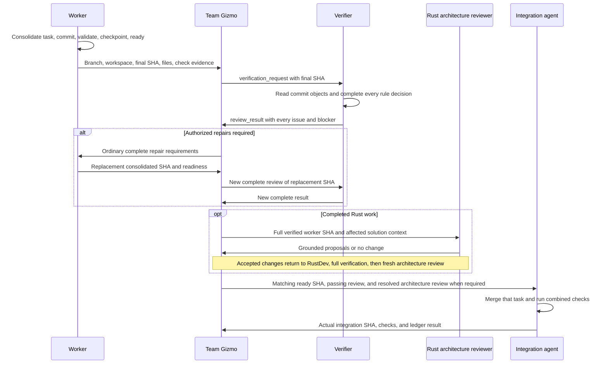

# Agent Verification Handoff

Team Gizmo starts verification when an agent with a cataloged verifier reports
committed work ready. The worker owns changes and repairs; its verifier owns
read-only review. Every verifier uses the same [request and result protocol](../agents/gizmo/skills/agent-verification/spec/communication-protocol.md),
[committed Git reads](../agents/gizmo/skills/agent-verification/spec/git-review.md), and [agent ledger](agent-ledger.md).
Gizmo requires a complete passing review before integration. Completed Rust work
then follows the [architecture handoff](#review-rust-architecture-after-verification)
before integration.



The integration path below applies to authorized implementation. Review-only
tasks stop after reporting the verifier result, as required by the task boundary.

## Required actions

### Discover the verifier from the worker catalog

1. Read the selected worker's entry in its team's `AGENTS.md` catalog. An optional
   **Verifier** property links to the verifier's role instructions. Resolve it
   relative to that catalog; the linked role must also have its own catalog entry.
2. Require the linked role's catalog entry and supported ledger team/role identity.
   Use that role for every completed write assignment by the worker. Do not infer
   a verifier from file extensions, role-name suffixes, or an earlier assignment.
   A worker without a Verifier property follows ordinary task completion.
3. Apply this handoff unchanged to each declared pair. The verifier's role and
   linked skill declare the complete review catalog. The shared
   [verification skill](../agents/gizmo/skills/agent-verification/SKILL.md) owns
   index-only loading; its protocol owns exhaustive review. Gizmo supplies operational assignment
   context and the request SHA. No task-specific verifier instructions are needed.
4. Retain the pairing with the worker task through repairs and integration.
   Several worker roles may share one verifier. Read-only verifier results finish
   through the ledger's read-only path; completing a report does not trigger
   another verifier assignment.
5. If a declared link, role, or required skill is missing or inconsistent, report
   the context blocker before review or integration. Do not silently skip the gate.

**Prohibited:** add a `tech-writer` conditional to Gizmo or launch a Rust review
for every `.rs` file regardless of the assigned worker.

**Required:** follow the tech writer's Verifier link to its cataloged reviewer
and use the same request, report, repair routing, and integration gate as Rust.
Adding another pair changes its catalogs and role/skill, without changing Gizmo.

### Preserve the parent task's scope

1. Apply the [task boundary](../../../CIRCUIT-BREAKER.md#keep-the-users-task-boundary)
   before assigning verification. Carry the parent's permitted changes and
   stopping condition in the existing assignment context.
2. For a review-only request, obtain the complete report and return every finding,
   blocker, and validation limitation through the hierarchy. Do not start the
   repair or integration steps below. A `changes_required` verdict describes
   the code; it is not permission to change it.
3. For authorized implementation or an explicitly requested repair exercise,
   use the repair steps below for in-scope issues. Preserve unrelated findings
   in the report without assigning their repair. Do not approve integration
   while a required compliance decision remains violated or blocked.

**Prohibited:** a request to check the verifier automatically becomes a
fixture repair task because the verifier returned useful repair instructions.

**Required:** return the exhaustive review and bounded behavior-check evidence.
Start a repair exercise only when the user's request includes that outcome.

### Apply the selected execution mode

- **`multi_agent`**
  - Gizmo assigns development, verification, repairs, and integration to their
    respective agents through the existing host and ledger workflow.
- **`single_agent`**
  - Perform those responsibilities locally without launching subagents.
  - Keep the same inventories, exhaustive review, and complete issue reporting.
  - State that independent verifier context isolation was not exercised.

**Prohibited:** select `single_agent`, launch a verifier anyway, or describe
self-review as an independent subagent review.

**Required:** perform the full review locally in `single_agent` mode and report
that limitation. Use the assignments below when running in `multi_agent` mode.

### Receive the worker's committed result

1. Give the worker ordinary task requirements and the existing
   [task-completion procedure](../../delivery-team/agents/integration-agent/skills/local-feature/practices/local_feature/task-commits.md#finish-task-work).
   Require one consolidated task commit. The integration owner supplies the
   task branch, worktree, and fixed `task_base_sha`; the worker follows the ordinary
   delivery commands to consolidate private checkpoints before readiness.
   It must run required checks, confirm a clean checkout, and
   record its final checkpoint and readiness before notifying Gizmo.
2. Keep verifier context out of the worker assignment. Do not supply this
   handoff, the verifier role or skill, or review bookkeeping. Gizmo owns the
   decision to start verification after receiving the worker's result.
3. Receive the branch, workspace, final SHA, changed-file list, validation
   evidence, and unresolved issues. Check durable readiness even if the host
   notification is missing.
   - If no changes were needed, retain the unchanged SHA and report that fact.
     Do not require an empty commit just to produce a handoff.

**Prohibited:** give the worker the verifier skill and ask it to manage its own
verification handoff, then treat its “done” message as integration approval.

**Required:** receive the worker's ordinary committed result, confirm its recorded
readiness, and let Gizmo arrange the separate review.

### Check the Git handoff

1. Use these values from the ordinary worker result: `task_path` is its
   absolute worktree, `task_branch` its assigned branch, and `task_sha` its full
   final SHA. Read `checkpoint_sha` from the ready ledger record and retain the
   `task_base_sha` supplied at workspace setup. Gizmo inspects Git; it does not
   stage, commit, reset, or merge on the worker's behalf.
2. Run the read-only checks:

   ```sh
   git -C "$task_path" branch --show-current
   git -C "$task_path" status --short
   git -C "$task_path" rev-parse --verify HEAD
   git -C "$task_path" rev-list --count "$task_base_sha..$task_sha"
   git -C "$task_path" rev-list --parents -n 1 "$task_sha"
   test "$task_sha" = "$checkpoint_sha"
   ```

   Require the assigned branch, empty status, and HEAD equal to `task_sha`.
   For changed work, the count must be `1` and the parent listing must contain
   exactly `task_sha task_base_sha`. If there was no change, require HEAD equal
   to the base and report no change; do not manufacture an empty commit.
   Finish a no-change implementation task through the existing ledger path;
   do not present a review of an unrelated base commit as a new code change.
3. Return a mismatch to the Git or task owner before starting review.
   Do not treat the last commit of an unconsolidated branch as the complete task.
   Keep the base in delivery assignment context; the verifier still receives
   only one SHA and derives its first parent from Git.
4. Send the verified `task_sha` as `commit_sha` in `verification_request`.
   Tell the verifier to use its [committed-object commands](../agents/gizmo/skills/agent-verification/spec/git-review.md).
   The passing report's SHA becomes `reviewed_sha` for the integration owner.

**Prohibited:** the branch has two task commits, but Gizmo sends only the last
SHA and treats its first-parent diff as all of the worker's work.

**Required:** the worker consolidates its private task commits, validates the
final SHA, and records a matching checkpoint. Gizmo checks the one-commit handoff
before sending that SHA to the verifier.

### Assign the read-only verifier

1. Before integration, record a read-only task with the selected verifier's
   cataloged team/role identity. Include the worker task ID and reviewed SHA in its objective
   or continuation notes.
2. Supply the result from the worker and the normal
   [assignment context](../../AGENTS.md#assignment-context): project and library
   roots, workspace, session choices, acceptance criteria, required checks, and
   available validation evidence.
3. Supply the selected verifier's own role and review skill, which declares its
   complete review catalog. Apply the shared
   [index-only loading rules](../agents/gizmo/skills/agent-verification/SKILL.md#keep-subject-practice-context-index-only).
   Do not supply the worker's role, skills, practice Markdown, or authoring
   checklist. Keep operational assignment context separate from practice context.
   Use a fresh
   review context when the host supports it. Do not inherit the worker's
   conversation or choose review rules from the worker's self-assessment.
   - If the host cannot provide that separation, report the limitation.
4. Sequence the review after worker readiness. Do not make the unintegrated
   worker task a ledger dependency: claims require dependencies to be integrated,
   so that dependency would prevent this pre-integration review from starting.
   Use ledger dependencies only for already integrated prerequisites.
5. Launch the verifier and send the explicit SHA through the
   [review request protocol](../agents/gizmo/skills/agent-verification/spec/communication-protocol.md#request-a-review).
   The request identifies one commit. If the verifier sends `need_commit`, resend
   a complete request with a resolvable SHA.
6. Keep the worker branch stable during review. Require all changed files,
   every required rule, and all cross-rule checks to be covered. Do not restrict
   review to rules selected by the worker or findings from an earlier pass.

**Prohibited:** inherit the worker's conversation or make the review depend on
integrating the very worker task it must check first.

**Required:** create an independently claimable read-only task with its own
verifier context, the worker's ready SHA, and the complete review scope.

### Check the complete result

1. Apply the protocol's
   [result rules](../agents/gizmo/skills/agent-verification/spec/communication-protocol.md#return-the-result-and-route-it).
   Require every issue and blocker in the verifier's message, with the full
   context, evidence, correction, and validation needed for repair.
2. Reconcile that message with the report in
   `progress.extensions.verification_report`. Check its SHA, inventories,
   every rule/file and cross-rule decision, supporting evidence, and counts.
   Reject missing findings, unsupported decisions, or a summary-only handoff.
   Reconcile the snapshot with every entry reachable from the review skill's
   declared catalog root. Do not derive expected coverage from the report's
   selected rules alone. Require every expected decision key; matching totals
   cannot excuse skipped rules or duplicate decisions.
3. Act on the verified verdict. A review task marked `ready` means its report
   is complete; it does not mean the code passed. Keep integration blocked for
   violations, incomplete coverage, missing evidence, or unresolved policy.

**Prohibited:** accept “two issues; see the ledger” or integrate because a review
with verdict `changes_required` reached `ready`.

**Required:** require both fully explained issues in the message, verify their
coverage record, and route both repairs before considering integration.

### Route every repair and blocker

1. Within the [authorized parent scope](#preserve-the-parent-tasks-scope), put
   all in-scope repairs into one bounded assignment for the responsible worker.
   Preserve each issue's rule/source, committed location, context, evidence,
   required correction, and validation. Require strict adherence to the rules.
   Do not shorten issues to titles or forward only a selection.
2. Keep the assignment an ordinary task. Include all repair context,
   but do not forward verifier instructions, review inventories, or ledger
   bookkeeping. The worker returns its committed result to Gizmo.
3. Route catalog ambiguity to the subject owner and authorized instruction edits
   to the tech writer. Report any needed edit outside the parent scope for a
   user decision. Do not ask the worker to guess policy. Resolving a worker
   issue does not clear an unrelated catalog or evidence blocker.
4. Before resuming the worker, follow the ledger's
   [stopped-or-finished recovery procedure](agent-ledger.md#recovery-and-stale-work).
   Requeue the task and preserve its branch and worktree. The worker validates
   its fixes and repeats the one-commit completion procedure. The replacement
   commit includes the whole task relative to its assigned base. It records a
   new checkpoint and readiness, then supplies the new SHA. Preserve the prior
   review in ledger history; never relabel it as a review of the replacement.

**Prohibited:** send only the identity issue when the verifier also found an
export-mode violation, or ask the worker to decide an unclear catalog exception.

**Required:** assign both complete repairs to the worker and send the
policy question to its owner. Preserve the unresolved blocker until it is answered.

### Require a complete review of each repair

1. Create a new read-only verifier task for the replacement commit. Retain the
   previous report in its original task history and supply it as verifier context.
   Refresh the requirement snapshot if an authorized clarification changed it.
2. Require all rules and changed files to be checked again, including previous
   repair items and newly introduced defects. Do not accept a fixes-only review
   or reuse the previous task's ready state as approval of the new SHA.
3. Continue until the new report passes. If a repair repeats without progress
   or requirements conflict, report the concrete blocker to Prime. In
   `single_agent` mode, report it to the user. Do not accept the defect or repeat
   an unchanged assignment indefinitely.

**Prohibited:** accept the worker's “all fixed” message as approval of its
replacement commit without another complete verifier pass.

**Required:** give the new verifier the new SHA and previous report, then require
fresh evidence for all earlier repairs and the entire new change.

### Review Rust architecture after verification

1. After a complete Rust verifier pass for a completed Rust worker commit,
   assign the [Rust architecture reviewer](../../dev-team/agents/rust-refactoring/AGENTS.md)
   a read-only task under `Development/RustRefactoring`. Supply the same full
   consolidated SHA, task base, passing report, scope, and affected project
   architecture. Keep the branch stable. Sequence this through Gizmo without
   making the unintegrated worker task a ledger dependency.
2. Supply the reviewer's own role and
   [Improve Architecture skill](../../dev-team/agents/rust-refactoring/skills/improve-architecture/SKILL.md).
   That skill owns architectural judgment and report contents. Do not supply or
   load the Rust developer role or implementation skill bundle for this review.
3. Check that the returned report covers the full worker change and affected
   solution at the verified SHA. Resolve missing evidence before deciding the
   result. Record the report and Gizmo's disposition in the existing ledger;
   use ordinary prose and task records, without a new protocol or runtime state.
4. Decide which proposals are worthwhile and within the authorized scope.
   Record why each is accepted, declined, or deferred. A supported no-change
   conclusion is a valid result; recommendations do not compel new work.
   Report broader proposals through the hierarchy without expanding the task.
5. For accepted improvements, assign the complete actionable findings to the
   Rust developer. Use the existing recovery and ordinary task-completion paths
   to obtain a replacement consolidated commit containing the whole worker task.
   Require its mandatory checks, a fresh complete Rust verifier pass, then a
   fresh architecture review of the entire replacement commit and affected
   solution. A fixes-only review or an earlier report cannot approve it.
6. Once the current SHA has passing verification, a complete architecture report,
   and no accepted improvements left unimplemented, pass that report and Gizmo's
   disposition with the matching SHA to integration. Review-only assignments
   stop with their reports. In single-agent mode, perform these responsibilities
   locally under the same scope and evidence requirements.

**Prohibited:** send architectural findings to the reviewer for implementation,
or integrate its replacement after checking only the proposed module move.

**Required:** Gizmo assigns the accepted move to RustDev, receives the full
replacement commit, obtains complete Rust verification and fresh architecture
review, then passes both reports and its decision for that same SHA to integration.
If the review supports no improvement, record that conclusion and proceed without
manufacturing a refactor.

### Integrate the reviewed revision

1. Supply the integration agent with the passing report, reviewed SHA, and task
   branch, worktree, and consolidation base. Require both the branch head and
   worker ready checkpoint to match
   that SHA. For Rust work, include the architecture report and Gizmo disposition
   from the [architecture handoff](#review-rust-architecture-after-verification).
   A later commit requires new applicable reviews before integration.
2. Give the integration owner the
   [reviewed-task integration protocol](../../delivery-team/agents/integration-agent/skills/local-feature/spec/reviewed-integration.md).
   It applies the review gate before the ordinary Git merge procedure and
   requires combined checks. A verifier pass does not replace those checks.
   The integration agent owns `git merge`; the worker owns implementation commits
   and conflict-resolution commits. The verifier never commits. The PR agent
   owns pushing the integrated feature under `create_pr`.
   - Route conflict resolutions or later repairs through the responsible worker and a
     complete verifier pass before retrying integration. Rust replacements also
     repeat the architecture handoff.
3. Retain review results and repair history in the existing tasks. After accepting
   a read-only review's result, record its completion through the ledger's
   existing read-only integration path. Do not require a verifier code commit.

**Prohibited:** integrate a newer branch head using its predecessor's passing
report, or treat successful Git integration as proof that combined checks passed.

**Required:** integrate the matching reviewed revision, run the combined checks,
and return any required repair through its owner and verification.
